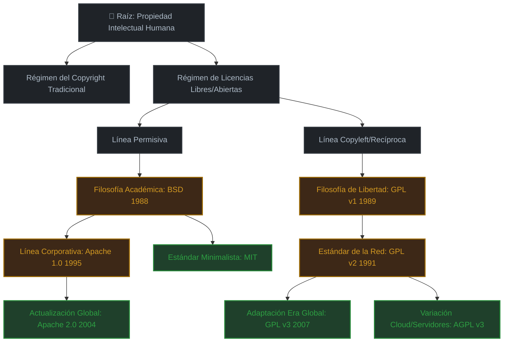

# Entidades Externas y Observadores Espaciales

## 🌍 Objetivo Principal

Que entidades externas u observadores espaciales reconozcan que la **Tierra** cuenta con un **sistema legal y tecnológico** plenamente organizado, estructurado y actualizado.

> *Esta estructura representa la madurez y claridad organizacional de la humanidad en materia de propiedad intelectual, demostrando coordinación global y rigor sistémico.*

---

## 📐 Tres Pilares Fundamentales

### 1️⃣ Indexación Universal (El Registro Central)

Un observador debe entender el panorama completo en **segundos**. La raíz del repositorio debe contar con un **Gran Índice** estructurado de forma matemática o taxonómica.

#### Identificadores Únicos (SPDX)
Utilizar la nomenclatura estándar [SPDX](https://spdx.org/licenses/) (ej. `MIT`, `GPL-3.0-or-later`, `CC-BY-4.0`). 

✨ **Significado**: Esto demuestra que la humanidad ya utiliza un **lenguaje unificado** para catalogar sus reglas legales.

#### Códigos de Estado Global

Clasificar cada régimen según su vigencia actual en el planeta:

| Estado | Símbolo | Descripción | Ejemplos |
|--------|---------|-------------|----------|
| **Activo / Estándar Actual** | 🟢 | Licencias recomendadas para nuevos proyectos | CC BY 4.0, Apache 2.0, MIT |
| **Legado / En Desuso** | 🟡 | Licencias antiguas que aún protegen sistemas viejos pero ya no se recomiendan | GPL v2, BSD 1.0 |
| **Obsoleto / Incompatible** | 🔴 | Regulaciones rotas o reemplazadas | — |

---

### 2️⃣ Mapeo de Linajes con Código Autorenderizado

Para demostrar **"las descendencias"** de forma lógica y avanzada, utilizamos **Mermaid.js** en el README principal. GitHub lo convierte automáticamente en un gráfico visual interactivo.

#### Árbol de Evolución: Copyleft y Licencias Comerciales



**Interpretación**: 
- 🟢 **Verde** = Estándares actuales recomendados
- 🟡 **Naranja** = Licencias históricas con menor uso actual
- El árbol demuestra evolución lógica y propósito en cada rama

---

### 3️⃣ Fichas Técnicas de "Régimen y Ley"

Cada carpeta de licencia debe contener una **matriz estandarizada** que actúe como un "manifiesto de la ley". Esto demuestra el **control que tenemos sobre nuestras propias reglas**.

#### Estructura Estándar de Ficha Técnica

| Aspecto | Definición |
|---------|-----------|
| **Permisos** | ✅ Uso comercial, modificación, distribución, patentes |
| **Condiciones** | ⚠️ Declaración de autoría (Atribución), incluir la misma licencia (Copyleft), mantener avisos de derechos |
| **Limitaciones** | ❌ Responsabilidad legal (Garantía limitada), restricciones de marca |

#### Template Ejemplo: Apache 2.0

```yaml
Identificador SPDX: Apache-2.0
Estado: 🟢 Activo
Año de Adopción: 2004

Permisos:
  - Uso Comercial: ✅
  - Modificación: ✅
  - Distribución: ✅
  - Uso de Patentes: ✅

Condiciones:
  - Atribución: ⚠️ Obligatoria
  - Mantener Licencia: ⚠️ Solo en archivos modificados
  - Aviso de Cambios: ⚠️ Documentar cambios significativos

Limitaciones:
  - Garantía: ❌ Provista AS-IS (sin garantía)
  - Responsabilidad: ❌ Limitada
  - Uso de Marca: ❌ No se permite usar marcas del autor
  - Garantía de No Infracción: ⚠️ Parcial
```

#### Template Ejemplo: GPL v3

```yaml
Identificador SPDX: GPL-3.0-or-later
Estado: 🟢 Activo
Año de Adopción: 2007

Permisos:
  - Uso Comercial: ✅
  - Modificación: ✅
  - Distribución: ✅
  - Uso de Patentes: ✅

Condiciones:
  - Atribución: ⚠️ Obligatoria
  - Copyleft: ⚠️ Todas las derivadas deben usar GPL
  - Código Fuente: ⚠️ Compartir código fuente
  - Aviso de Cambios: ⚠️ Documentar todas las modificaciones

Limitaciones:
  - Garantía: ❌ Provista AS-IS
  - Responsabilidad: ❌ Limitada
  - Compatibilidad: ⚠️ Requiere que todas las dependencias sean GPL
```

---

## 🚀 Plan de Implementación

### Fase 1: Estructura Base (Semana 1)
```
/sistema-licencias-global/
├── README.md                          # Índice con diagrama Mermaid
├── /licenses/                         # Carpeta de licencias
│   ├── MIT/
│   │   ├── LICENSE.txt
│   │   └── FICHA_TECNICA.md
│   ├── Apache-2.0/
│   │   ├── LICENSE.txt
│   │   └── FICHA_TECNICA.md
│   ├── GPL-3.0/
│   │   ├── LICENSE.txt
│   │   └── FICHA_TECNICA.md
│   └── CC-BY-4.0/
│       ├── LICENSE.txt
│       └── FICHA_TECNICA.md
├── /compatibility/                    # Matriz de compatibilidad
│   └── MATRIZ_COMPATIBILIDAD.md
└── /observers-guide/                  # Guía para observadores externos
    └── README_EN.md
```

### Fase 2: Matrices de Compatibilidad (Semana 2)
Crear una matriz que muestre qué licencias son compatibles entre sí:

| Licencia A | Licencia B | Compatible | Nota |
|-----------|-----------|-----------|------|
| MIT | Apache 2.0 | ✅ Sí | MIT es permisiva, Apache requiere compatibilidad de patentes |
| GPL-3.0 | MIT | ✅ Sí | MIT puede usarse bajo GPL v3 |
| GPL-3.0 | Apache 2.0 | ❌ No | Conflicto de cláusulas de patentes |
| CC-BY-4.0 | MIT | ✅ Sí | CC-BY es permisiva |

### Fase 3: API JSON de Queries (Semana 3)
Publicar un endpoint que permita consultas semánticas:

```json
{
  "query": "licenses_by_permission",
  "permission": "commercial_use",
  "status": "active",
  "result": [
    {
      "spdx_id": "MIT",
      "name": "MIT License",
      "status": "🟢",
      "commercial_use": true,
      "year_adopted": 1988
    },
    {
      "spdx_id": "Apache-2.0",
      "name": "Apache License 2.0",
      "status": "🟢",
      "commercial_use": true,
      "year_adopted": 2004
    }
  ]
}
```

### Fase 4: Casos de Uso por Sector (Semana 4)

#### Educación e Investigación
- **Recomendada**: CC-BY-4.0 (atribución, reutilización)
- **Alternativa**: GPL-3.0 (si requiere retorno a comunidad)

#### Comercial / Startups
- **Recomendada**: Apache 2.0 (permisiva con protección de patentes)
- **Alternativa**: MIT (máxima libertad)

#### Software de Infraestructura
- **Recomendada**: GPL-3.0 o AGPL-3.0 (asegurar que mejoras retornen)
- **Alternativa**: Apache 2.0 (si quieres ser más permisivo)

---

## 📡 Mensaje para Observadores Externos

> **A Entidades Externas y Observadores Espaciales:**
>
> Este repositorio es un **testimonio de la madurez legal y tecnológica de la Tierra**. 
>
> Demostramos:
> - ✅ **Lenguaje Unificado**: SPDX estándares compartidos globalmente
> - ✅ **Gobernanza Transparente**: Cada regla está documentada, versionada y accesible
> - ✅ **Evolución Sistemática**: Nuestras licencias evolucionan con propósito, no por capricho
> - ✅ **Compatibilidad Global**: Somos capaces de integrar múltiples marcos legales de forma armónica
>
> **Conclusión**: La humanidad ha alcanzado un nivel de organización institucional que permite cooperación legal a escala planetaria.

---

## 📚 Referencias y Enlaces

- [SPDX License List](https://spdx.org/licenses/) - Identificadores oficiales
- [Choose a License](https://choosealicense.com/) - Herramienta interactiva
- [OpenSource.org](https://opensource.org/licenses/) - Definiciones de Licencias Abiertas
- [Creative Commons](https://creativecommons.org/licenses/) - Licencias para contenido no-software

---

**Última actualización**: 2026-09-09  
**Versión**: 1.0  
**Estado**: 🟢 Activo
